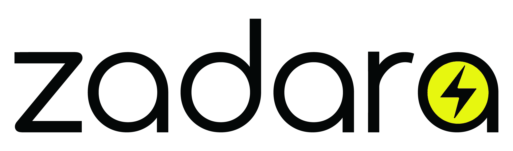

# Zadara Kubernetes Operator

Zadara Operator (zOperator) enables storage provisioning services via Zadara's CSI driver and data management capabilities for K8s applications.

---
## Table of Contents

[Overview](#overview)

[Installation](#installation)

[Zadara Custom Resources](#zadara-custom-resources)

[Operator Configuration](#operator-configuration)

[Usage Examples](examples/README.md)

[CLI](#cli)

[CSI Driver](#csi-driver)

[Troubleshooting](docs/troubleshooting.md)

[Contact us](#contact-us)

[About](#about)

---
### Overview

The Zadara Operator provides storage and data management for K8s stateful
applications as a cloud-native service, while leveraging Zadara's enterprise
grade Storage-as-a-Service VPSA for provisioning and managing persistent
storage.

Zadara Operator provides:
* Zadara CSI driver automatic installation and management
* Automatic K8s application discovery.
* Application protection using an intelligent and efficient snapshots mechanism.
* Custom snapshots scheduling for application protection.
* Instant application clone.
* CLI for centralized management for Zadara's K8s assets.
* Migrate application from one cluster to another.


### About Zadara

Zadara provides companies and service providers agile, secure
enterprise storage as a consumption-based service. Any location, any
data type, any protocol. Zadara offers resource isolation, exceptional
security, and management control.

More information at https://www.zadara.com/

---
### Installation

[Install using Helm Chart](docs/install_helm.md)

[Install using OLM](https://operatorhub.io/operator/zoperator)

---
### Zadara Custom Resources

[Custom resources](https://kubernetes.io/docs/concepts/extend-kubernetes/api-extension/custom-resources/#custom-resources) are extensions of the Kubernetes API. This page discusses when to add a custom resource to your Kubernetes cluster and when to use a standalone service. It describes the two methods for adding custom resources and how to choose between them.

Zadara's config  [Zadara Custom Resources](docs/custom_resources.md).

---
### Operator Configuration

Zadara Operator (zOperator) is configured using a [K8s ConfigMap](https://kubernetes.io/docs/concepts/configuration/configmap); Read more about [Zadara's Config Map](docs/config_map.md).

---
### CLI

Zadara K8s CLI provides centralized management for Zadara's K8s assets.
The CLI allows managing applications, snapshots & clones.
the CLI also allows controlling and manage the Operator like viewing the status of the cluster, managing Operator configuration, viewing CSI/Operator logs and more.
In addition, the CLI support helper commands such as managing storageclass & volumes.

#### Install

* If zOperator installed on your cluster, you may copy CLI from it:
```shell script
POD_NAME=$(kubectl get pods -A -l name=zoperator -o custom-columns=NAME:.metadata.name --no-headers=true)
POD_NAMESPACE=$(kubectl get pods -A -l name=zoperator -o custom-columns=NAMESPACE:.metadata.namespace --no-headers=true)
kubectl cp $POD_NAMESPACE/$POD_NAME:zadara /usr/local/bin/zadara && chmod +x /usr/local/bin/zadara
```

* You may also download the CLI (for Linux) from [here](cli/zadara) and copy it to '/usr/local/bin/zadara'.

#### Shell Completion

Zadara CLI can generate shell completions for multiple shells. The currently supported shells are:

* Bash
* Zsh
* Fish
* PowerShell

To enable autocomplete for your shell, run `zadara completion --help` and follow the instructions.

More information at [Documentation](cli/docs/README.md)

---
### CSI Driver

Zadara provides a CSI driver for seamless volume provisioning.
More information at https://github.com/zadarastorage/zadara-csi

---
### Contact Us

Got a question? we love to help - email us at **k8s@zadara.com** or visit https://support.zadarastorage.com.

