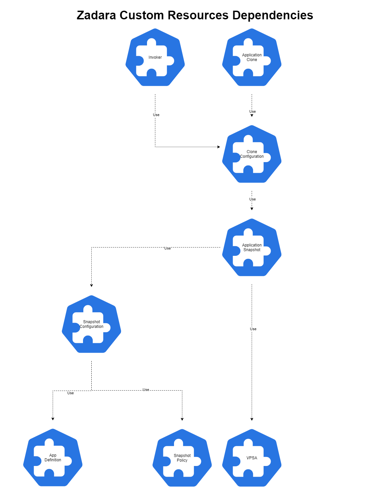

# Zadara Operator Troubleshooting

### Zadara Custom Resource still exists after deletion

When one of [Zadara Custom Resource](custom_resources.md) still exists after deletion, it is probably because of [Finalizers](https://kubernetes.cn/docs/reference/using-api/api-concepts/#resource-deletion).
During CR initialization, Zadara Operator may add to the CR finalizers.
There are 2 types of finalizers:
1. *zadara.com/in-use-protection* - Another CR is using the deleted CR (See [Custom Resource Dependency Protection](#custom-resource-dependency-protection) section for more information).
2. *zadara.com/need-cleanup* - The operator has to clean up before releasing the CR (See [Custom Resource Cleanup Protection](#custom-resource-cleanup-protection) bellow for more information).

To fully remove the CR, you may edit the CR and remove finalizers from it.
NOTE: It is not advised to remove the finalizer manually only when understanding why the Operator failed to remove the finalizer by itself.

#### Custom Resource Dependency Protection

[Zadara Custom Resources](custom_resources.md) (CR) have dependencies on each other, for example:
Snapshot Configuration CR depends on AppDefinition & SnapshotPolicy CRs:

```yaml
---
apiVersion: zadara.com/v1alpha1
kind: SnapshotConfiguration
metadata:
  name: snapshot-cfg
spec:
  appDefinition: "app-definition"
  policies:
    - "every-ten-minutes"
    - "every-two-minutes"
```

Here is the Zadara CRs dependencies diagram:



For every CR which is being used (arrow ⟶ to CR in the diagram), there must be
*zadara.com/in-use-protection* [finalizer](https://kubernetes.cn/docs/reference/using-api/api-concepts/#resource-deletion).
When user deletes a CR, the Operator will remove the *zadara.com/in-use-protection* [finalizer](https://kubernetes.cn/docs/reference/using-api/api-concepts/#resource-deletion) iff the CR is not in use by another CR.

#### Custom Resource Cleanup Protection

For some [Zadara Custom Resources](custom_resources.md), the operator needs to run a cleanup before removing the CR. For example:
If a vpsa has CSI plugin, the operator must remove the CSI plugin before deletion of the Vpsa CR.

When user deletes a CR, the Operator will remove the *zadara.com/need-cleanup* [finalizer](https://kubernetes.cn/docs/reference/using-api/api-concepts/#resource-deletion) iff the cleanup ended.

---

### Manual SnapshotSet/Clone cleanup on Operator failure

When user deletes Application Snapshot/Clone CR, the operator will reconcile and will try delete the SnapshotSet/Clone from the VPSA.
In case of failure, you may use the VPSA REST api commands to clean up manually.

#### Delete Snapshot Set from the VPSA

Fetch a list of the Vpsa Snapshot Sets:
```shell script
# Replace here:
$ HOSTNAME=<SET HOSTNAME!>
$ TOKEN=<SET TOKEN!>

$ curl -X GET -H "Content-Type: application/json" -H "X-Access-Key: ${TOKEN}"  "https://${HOSTNAME}/api/consistency_groups/snapshot_sets.json"
{
  "response": {
    "status": 0,
    "snapshots": [
      "snap-00000005",
      "snap-00000006"
    ],
    "count": 2
  }
}
```

Choose a Snapshot Set and delete:
```shell script
$ SNAPSHOT_SET=<SET SNAPSHOT_SET!>

$ curl -X DELETE -H "Content-Type: application/json" -d '{"snapsetid":"${SNAPSHOT_SET}"}' -H "X-Access-Key: ${TOKEN}"  "https://${HOSTNAME}/api/consistency_groups/delete_snapshot_set.json"
{
  "response": {
    "status": 1073751835
    "status-msg": "The request has been submitted, and it may take a few moments to complete. Check event-log for further details"
  }
}
```

Verify deletion again:
```shell script
$ curl -X GET -H "Content-Type: application/json" -H "X-Access-Key: ${TOKEN}"  "https://${HOSTNAME}/api/consistency_groups/snapshot_sets.json"
{
  "response": {
    "status": 0,
    "snapshots": [],
    "count": 0
  }
}
```

#### Delete Snapshot Set Clone from VPSA

Fetch a list of the Vpsa Snapshot Set Clones:
```shell script
# Replace here:
$ HOSTNAME=<SET HOSTNAME!>
$ TOKEN=<SET TOKEN!>

$ curl -X GET -H "Content-Type: application/json" -H "X-Access-Key: ${TOKEN}"  "https://${HOSTNAME}/api/consistency_groups/snapshot_set_clones.json"
{
  "response": {
    "status": 0
    "snapshot-sets-count": 1
    "snapshot-sets": [
      "snapshot-set": {
        "snapshot-set-id": "snap-test-2020-06-15--13-40-04",
        "cgs-count": 1
        "cgs": [
          "cg": {
            "name": "cg-00000017",
            "display-name": "clone-snap-test-2020-06-15--13-40-04-cg-00000016",
            "status": "deleting",
            "pool-name": "pool-00010001",
            "pool-display-name": "p1",
            "source-cg": "pvc-214014b0-8580-4fbd-9353-c93e456b7f4e",
            "user-created": "NO",
            "working-snap-name": "snap-00000020",
            "snapshot-set-id": "snap-test-2020-06-15--13-40-04",
            "created-at": "2020-06-15T16:49:57+0300",
        ]
      },
    ]
    }
  }
}
```

Choose a Snapshot Set Clone and delete:
```shell script
$ SNAPSHOT_SET_CLONE=<SET SNAPSHOT_SET_CLONE!>

$ curl -X POST -H "Content-Type: application/json" -d '{"snapsetid":"${SNAPSHOT_SET_CLONE}"}' -H "X-Access-Key: ${TOKEN}"  "https://${HOSTNAME}/api/consistency_groups/delete_clone_of_snapshot_set.json"
{
  "response": {
    "status": 1073751835
    "status-msg": "The request has been submitted, and it may take a few moments to complete. Check event-log for further details"
  }
}
```

Verify deletion again:
```shell script
$ curl -X GET -H "Content-Type: application/json" -H "X-Access-Key: ${TOKEN}"  "https://${HOSTNAME}/api/consistency_groups/snapshot_set_clones.json"
{
  "response": {
    "status": 0
    "snapshot-sets-count": 1
    "snapshot-sets": []
  }
}
```

---

### General problem

In case of a failure or an unexpected behaviour, it is useful to check the Operator logs using Zadara CLI (TODO: add reference to CLI docs):
```
zadara logs operator
```

### Contact Us

Feel free to contact us at:
**k8s@zadara.com**

